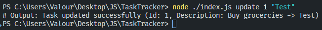
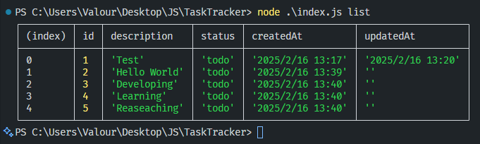
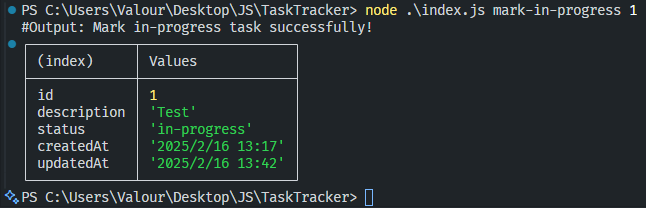
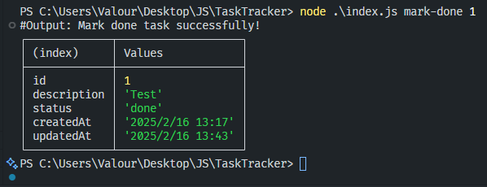

[Task Tracker Project (1/26 Roadmap.sh) ](https://roadmap.sh/projects/task-tracker)

*Build a CLI app to track your tasks and manage your to-do list.*
*Task tracker is a project used to track and manage your tasks. In this task, you will build a simple command line interface (CLI) to track what you need to do, what you have done, and what you are currently working on. This project will help you practice your programming skills, including working with the filesystem, handling user inputs, and building a simple CLI application.*
## Installation

### Clone repo
```
git clone https://github.com/lamloi1109/TaskTracker.git
```
### Run project
```
node ./index.js command argument
```
### Commands
#### Add Task
Adding a new task
```
node ./index.js add "Buy groceries"
```


#### Update Task
Updating tasks
```
node ./index.js update 1 "Test"
```


#### List Task
Listing all tasks

```
node ./index.js list
```


##### Listing tasks by status
```
node ./index.js list done
```

```
node ./index.js list todo
```

```
node ./index.js list in-progress
```

#### Mark Task
Marking a task as in progress or done
##### in-progress
```
node ./index.js mark-in-progress 1
```

##### Done
```
node ./index.js mark-done 1
```

#### Delete Task
```
node ./index.js delete 1
```


### Info
📧 Email: lamloi12a1@gmail.com  
📌 GitHub: [@lamloi1109](https://github.com/lamloi1109)